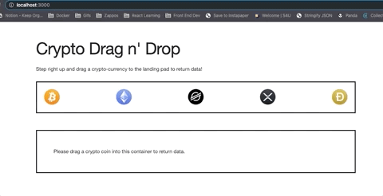

# Welcome to the Crypto Drag n' Drop Challenge

## Intro

This challenge is a pre-stubbed out ReactJS application. The goal of the challenge is to update the user interface to display information about the corresponding crypto currency coin when dragged and dropped into the landing zone as illustrated by the image below.

The site has been stubbed out for you. The two components you'll primarily be working with are the `CoinContainer.js` and `LandingPad.js` located in `src/components`.

They have corresponding CSS Module files available if you feel like updating styles (located in `src/css-modules`).

Lastly, Redux has been stubbed out in this implementation. While you could use React Hooks to implement this interface, we'd like for you to use Redux as your state/store. All neccessary files have been stubbed in `src/redux`.

## Directions

**_Please don't install and/or use any drag and drop libraries or currency formatting libraries. We wish for you to implement those behaviors natively in the app._**

Fork and clone this repository.

After cloning, in your local directory run `yarn install` and then `yarn start` to begin your development environment.

Inside the `src/redux/crypto.reducer.js` file you'll notice that the applications `initial state` has been set for you. This will inform you to what items returned from the API are expected to be in the dropzone view after the coin is dropped.

## Where Are We Getting The Data?

We'll be obtaining this data from the CoinGecko API. Using `fetch`, here is the call you'll be making to return data:

https://api.coingecko.com/api/v3/coins/<COIN_ID>

Here are the coins and their corresponding IDs you'll be using.

| Coin     | ID       |
| -------- | -------- |
| Bitcoin  | bitcoin  |
| Ethereum | ethereum |
| Stellar  | stellar  |
| XRP      | ripple   |
| Dogecoin | dogecoin |

Example Dogecoin Response: [Dogecoin Response](https://api.coingecko.com/api/v3/coins/dogecoin)

## Conclusion

The challenge isn't inteded to take much more than an hour to an hour and a half. You don't need to get too deep in the weeds when outputting data. For example, the response returns a description in many different languages - you only are asked to output one of them - no need to implement a UI piece for the user to choose. We want to keep this simple and straight forward.

We hope this is at least a little fun. Thanks for participating!
